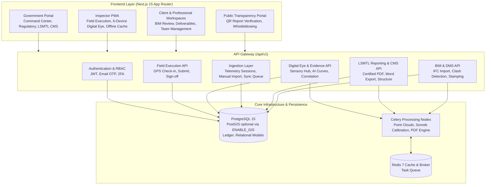

# Nexucon System Integration Architecture: Backend Implementation vs. Frontend Structure

**Document Reference:** `NEXUCON-ARCH-2026-V2`  
**Classification:** Enterprise System Architecture & Integration Specification  
**Status:** Active / Production Baseline  
**Last revised:** 2026-09-17 — the ingestion layer, geofence and accreditation
sections and the §5 scorecard were corrected against the code. Ratings in this
document are verified against the implementation, not asserted.  
**Backend root:** `Nexucon_backend/` (see [`README.md`](README.md))  

---

## 1. Executive Summary & High-Level System Architecture

The Nexucon platform is architected as an **integrated civic-tech and non-destructive testing (NDT) infrastructure oversight ecosystem**. It bridges municipal regulatory authorities (Lagos State Building Control Agency - LASBCA, Materials Testing Laboratory - LSMTL), licensed AEC professionals, real estate developers, and on-site field inspectors.

The platform consists of two primary operational codebases:
1. **Frontend (`/frontend`)**: A Next.js 15+ (App Router) TypeScript web application engineered with a multi-portal architecture, role-based route segmentation, responsive desktop suites, and an offline-first Progressive Web App (PWA) field inspection suite.
2. **Backend (`Nexucon_backend/`)**: A modular Django 4.2 and Django REST Framework (DRF) backend on PostgreSQL — with PostGIS enabled optionally via `ENABLE_GIS` — plus Celery/Redis workers for asynchronous processing and specialised signal-processing algorithms for multi-sensor hardware telemetry. Development and tests run on SQLite.



---

## 2. Frontend Portals vs. Backend Apps Matrix

The frontend codebase is organized into **5 distinct route groups**, which map onto **28 installed Django applications** on the backend — `apps.common` (shared base models, permissions, pagination and hashing) plus 27 domain apps:

| Frontend Portal / Route Group | Primary Path | Target User Group | Backing Django Applications | Backing Core Models |
| :--- | :--- | :--- | :--- | :--- |
| **Government Portal** | `app/(government)/government/dashboard/*` | State Regulators, LASBCA Directors, Ministry Officials | `apps.government`, `apps.analytics`, `apps.projects`, `apps.approvals`, `apps.compliance`, `apps.audit` | `Agency`, `District`, `Profile`, `Inspector`, `Project`, `ApprovalRequest`, `RegulatoryRequirement`, `AuditEvent` |
| **Inspector PWA** | `app/(inspector)/inspector/dashboard/*` | Field Inspectors, Certified NDT Technicians | `apps.inspections`, `apps.digital_eye`, `apps.evidence`, `apps.scans`, `apps.reports`, `apps.telemetry`, `apps.data_import`, `apps.sync` | `Inspection`, `Finding`, `StopWorkOrder`, `FieldDevice`, `PUNDITTest`, `GPRSurvey`, `EvidenceRecord`, `EvidenceFile`, `TelemetrySession`, `ImportBatch`, `SyncQueueItem` |
| **Client Portal** | `app/(client)/client/*` | Real Estate Developers, Property Owners | `apps.projects`, `apps.applications`, `apps.permits`, `apps.bim`, `apps.stakeholders` | `Project`, `Application`, `Permit`, `BIMModel`, `Developer`, `ProjectStakeholderTeam` |
| **Professional Hub** | `app/(professionals)/professional/*`, `mentors/*`, `mentee/*` | Structural Engineers, Architects, Mentors, Mentees | `apps.stakeholders`, `apps.bim`, `apps.documents`, `apps.accounts` | `LicensedProfessional`, `BIMModel`, `Document`, `User`, `Certification` |
| **Public Transparency** | `app/(landing)/*` | General Public, Whistleblowers, Prospective Buyers | `apps.public_portal`, `apps.reports`, `apps.compliance` | `ViolationReport`, `ArchivedReport`, `ComplianceCertificate` |

---

## 3. Domain-by-Domain Architectural Analysis

Each section below ends with an **alignment rating**, which is a claim about the code, not
an aspiration. A rating is only ever "Aligned" when every endpoint listed under it resolves
in `config/urls.py` and every model named exists in a migration. Where a subsystem is
partly built or deliberately deferred, the section says so in prose and §5 records it.

### 3.1. Authentication, Sessions & RBAC Security

#### Frontend Implementation
- **Location:** `app/(auth)/*`, `services/api.ts`, `lib/api.ts`.
- **Role Portals:** Separate login/registration flows for `/government/login`, `/inspector/login`, `/professional/login`, `/client/login`, `/mentors/login`, `/mentee/login`.
- **State Storage:** Access tokens stored in `localStorage` under keys `nexucon_access_token` and `token`.
- **Interceptors:** `services/api.ts` attaches `Authorization: Bearer <token>`, normalizes trailing slashes, automatically removes `Content-Type` for `FormData`, and handles HTTP 401 redirection based on user portal.

#### Backend Implementation
- **Application:** `apps.accounts`, `apps.government`.
- **Endpoints:**
  - `POST /api/v1/auth/login/` (`CustomLoginView` returning JWT pair + user profile & role).
  - `POST /api/v1/auth/register/` (`UserRegistrationView` with verification email trigger).
  - `POST /api/v1/auth/verify-email/` (Email OTP confirmation via Resend).
  - `POST /api/v1/auth/refresh/` (JWT token refresh).
  - `GET /api/v1/auth/me/` (`UserMeView` for session hydration).
  - `POST /api/v1/auth/2fa/*` (TOTP setup, verify, disable).
  - `POST /api/v1/auth/sessions/<id>/revoke/` (Session revocation).
- **Alignment Rating:** **Aligned**. Both email OTP verification and JWT token persistence mirror the frontend authentication flows.

---

### 3.2. Inspector Field PWA & Execution Engine

#### Frontend Implementation
- **Location:** `app/(inspector)/inspector/dashboard/*`, `services/inspector.ts`, `lib/offline-sync.ts`.
- **Key Capabilities:**
  - **Command Center:** Real-time KPI cards (Assigned Projects, Upcoming Inspections, Open Findings, Compliance Issues, Pending Evidence), Today's Schedule with GPS verification status, and Critical Findings feed.
  - **GPS Verification & Check-in:** Geofence verification against project boundaries before inspection checklist unlock.
  - **Execution Flow:** Checklist item marking (`PASS`, `FAIL`, `N/A`, `FLAGGED`), photo/audio attachment, immediate finding creation with severity grading (`LOW`, `MEDIUM`, `HIGH`, `CRITICAL`), and digital sign-off.
  - **Offline Sync Layer:** IndexedDB-backed offline queue (`lib/offline-sync.ts`) allowing full inspection execution without network connectivity, automatically replaying requests once connection is re-established.

#### Backend Implementation
- **Applications:** `apps.inspections`, `apps.government` (plus the three ingestion apps in §3.10).
- **Endpoints:**
  - `GET /api/v1/government/inspectors/me/dashboard/` (`InspectorDashboardView` returning consolidated KPIs, today's schedule, assigned projects, and critical findings).
  - `GET /api/v1/government/inspectors/me/` (`InspectorMeView`). Returns **404** with an honest `detail` when no accreditation is recorded — an absent badge must never render as a blank one, so it is not an empty object.
  - `GET/POST /api/v1/government/inspectors/`, `GET/PUT /api/v1/government/inspectors/<uuid:id>/` — issuing and maintaining accreditation. Creating a badge requires `IsDirector`; an Inspector sees only their own row.
  - `GET /api/v1/inspections/` (`InspectionViewSet` supporting query filters: `status`, `project`, `assigned_inspector`, `date`).
  - `POST /api/v1/inspections/<uuid:id>/execution/checkin/` (`InspectionCheckinView`).
  - `POST /api/v1/inspections/<uuid:id>/execution/checkout/` (`InspectionCheckoutView` — closes the visit; does **not** change `inspection.status`, because the spec records no transition and inventing one would be fabrication).
  - `POST /api/v1/inspections/<uuid:id>/execution/submit/` (`InspectionSubmitView` processing completed checklists, field observations, and evidence links).
  - `POST /api/v1/inspections/<uuid:id>/execution/sign-off/` (`InspectionSignOffView` storing inspector signature, badge number, and timestamp).
  - `POST /api/v1/inspections/findings/` (`FindingViewSet` for logging non-conformances and triggering automated Stop Work Orders).

- **Geofence — measured, not asserted.** Check-in computes the real haversine distance from the reported position to the project's **recorded site coordinates** and stores the result. It does **not** validate against a PostGIS polygon: `Project` carries a nullable `geofence_radius_m`, and the comparison is a distance against that radius. `DEFAULT_GEOFENCE_RADIUS_M` (50 m) is a platform *policy* fallback, not a recorded attribute — `Project.geofence_radius_m` is nullable precisely so no existing row claims a geofence nobody entered, and every check-in returns `radius_source` (`'project'` or `'platform_default'`) so the fallback can never be presented as the project's own setting.

  `gps_verified` is `true` **only** when all three hold: the project has coordinates recorded, the point is within the effective radius, and the reported accuracy does not exceed that radius. Everything else is `false` with a `geofence_reason` of `WITHIN_RADIUS`, `OUTSIDE_RADIUS`, `PROJECT_COORDINATES_NOT_RECORDED`, `ACCURACY_NOT_REPORTED` or `DEVICE_ACCURACY_EXCEEDS_RADIUS`. A ±200 m fix inside a 50 m radius is a false attestation, which is why `accuracy_m` is recorded at all. `GEOFENCE_ENFORCEMENT` (`off` | `warn` | `strict`, default `warn`) is the documented one-line rollout to blocking — see §4.4.

  On `Inspection`, an empty `geofence_state` means no evaluation ever ran, and a null `check_out_time` means the inspector has not checked out. Rows written before this work carry `gps_verified=true` with an empty `geofence_state`: that value was asserted unconditionally by the old code and is **not** trustworthy. It is not silently rewritten; clearing it requires a deliberate, signed-off run.

- **Accreditation.** `government.Inspector` holds `badge_number` (unique), `full_name`, `directorate`, `accreditation_status`, `accreditation_expiry` and issue/suspension fields. `full_name` is a deliberate **snapshot** — a badge is issued to a name, so the holder editing their profile must not silently change their accredited identity. `effective_status` derives `'EXPIRED'` at read time and never writes it back, because a nightly job flipping stored status would create a second source of truth.

  **No rows are seeded.** Every pre-existing badge is therefore `null` until a Director issues one. That is the correct outcome and a visible API change: the alternative was seeding fabricated badge numbers, which is the defect this work removes. The frontend must render the absent state.

- **Alignment Rating:** **Aligned.** Check-in, check-out, submit, sign-off and finding escalation correspond to DRF execution views. The badge-null change is a deliberate behavioural change requiring frontend coordination, not a parity gap.

---

### 3.3. Digital Eye: Multi-Sensor Telemetry & AI Pipeline

The Digital Eye system is the sensory backbone of Nexucon. It integrates raw physical NDT testing hardware into a real-time regulatory pipeline.

#### Frontend Sub-Page Breakdown
The inspector frontend separates hardware telemetry into **6 dedicated sub-pages** under `app/(inspector)/inspector/dashboard/digital-eye/`:
1. **`ts-1` (Tersus T-S1 LiDAR SLAM)**: Real-time point-cloud ingestion, trajectory tracking, battery/storage telemetry, and point count monitoring.
2. **`pundit` (PUNDIT UPV Ultrasonic)**: Ultrasonic pulse velocity testing, oscillogram waveform visualization, Sonreb calibration curves, and concrete compressive strength ($f_{ck}$ in MPa).
3. **`gpr` (GPR Radargram Radar)**: Subsurface radargram B-scan visualization, dielectric constant permittivity tuning, rebar cover depth measurement, and void/delamination flagging.
4. **`trimble` (Trimble Connect CDE)**: 3D BIM synchronization, IFC hierarchy exploration, and BCF (BIM Collaboration Format) deviation tracking.
5. **`gnss` (Tersus GNSS RTK)**: Dual-frequency geodetic benchmark logging, boundary point coordinate capture, PDOP/satellite quality metrics, and georeferencing.
6. **`audit-vault` (Multi-Sensor Cryptographic Ledger)**: SHA-256 evidence hashing, tamper-evident chain of custody, and multi-sensor correlation scores.

#### Backend Backing Architecture
- **Applications:** `apps.digital_eye`, `apps.scans`, `apps.evidence`.
- **Key Data Models & Endpoints:**
  | Hardware / Domain | Backend Model | Authoritative API Endpoint |
  | :--- | :--- | :--- |
  | **Field Device Fleet** | `FieldDevice` | `GET /api/v1/digital-eye/devices/` |
  | **Tersus T-S1 LiDAR** | `ScanSession`, `ScanFile` | `POST /api/v1/scans/<session_id>/upload/lidar/`, `GET /api/v1/scans/fleet/` |
  | **PUNDIT UPV** | `PUNDITTest`, `PUNDITReading` | `GET/POST /api/v1/digital-eye/pundit-tests/`, `POST .../import_readings/` |
  | **Sonreb Strength Curves**| `StrengthCurve`, `CoreSample` | `GET/POST /api/v1/digital-eye/nexucon-link/curves/`, `.../core-samples/` |
  | **GPR Subsurface Radar** | `GPRSurvey`, `GPRAnomaly` | `GET/POST /api/v1/digital-eye/gpr-surveys/`, `POST .../analyze/` |
  | **Trimble Connect CDE** | `TrimbleConnection`, `TrimbleProject` | `GET /api/v1/digital-eye/trimble/connections/`, `POST .../sync/` |
  | **GNSS RTK Geodetics** | `GnssSurvey`, `GnssBenchmark` | `GET/POST /api/v1/digital-eye/gnss-surveys/`, `.../benchmarks/` |
  | **Evidence Cryptography** | `EvidenceRecord`, `AIAnalysisRecord`| `GET/POST /api/v1/evidence/records/`, `GET /api/v1/evidence/findings/` |
  | **File Evidence** | `EvidenceFile` (OneToOne on `EvidenceRecord`) | `POST /api/v1/evidence/upload/`, `POST /api/v1/evidence/<uuid:pk>/verify/`, `GET /api/v1/evidence/inspection/<uuid:id>/` |
  | **AI Correlation Engine** | `CorrelationFinding` | `GET /api/v1/evidence/intelligence/projects/<id>/` |
- **Alignment Rating:** **Aligned**. The frontend `services/digitalEye.ts` uses the exact paths, query params, and multipart form schemas exposed by `apps.digital_eye.urls`.

- **File evidence.** `EvidenceFile` is a separate row rather than a `FileField` on `EvidenceRecord`, because `EvidenceRecord.compute_hash()` is defined over the JSON payload. Bytes in the same row would make `/verify` ambiguous about what it verified, and a record with no payload would hash `{}` and "verify" cleanly — a false attestation. `last_verify_ok` is a **nullable** boolean: `default=False` would assert failure before anything had verified it. Verification re-reads the stored bytes and hashes them, which is the only way to answer "is this still the file that was uploaded?"; above `EVIDENCE_VERIFY_MAX_BYTES` it reports `file_bytes_ok: null` with the reason rather than claiming a `true` it did not check. Uploading requires the client hash and byte count to match if it sends them — a mismatch is refused naming both values, and nothing is stored.

---

### 3.4. Document Management & Lagos State LSMTL Report CMS

#### Frontend Implementation
- **Location:**
  - `app/(government)/government/dashboard/documents`: Enterprise DMS with folder trees, versioning, review workflows, and official stamps.
  - `app/(inspector)/inspector/dashboard/reports`: Field report generation and PDF preview.
  - `app/(landing)/verify/report`: Public QR code verification portal.
- **Reporting CMS Features:**
  - Password-protected report template section overrides.
  - Reordering, toggling, and adding custom sections for NDT engineering dossiers.
  - Word (`.docx`) working-copy export alongside certified PDF generation.
  - Approving Engineer COREN seal and signature injection.

#### Backend Implementation
- **Applications:** `apps.documents`, `apps.reports`.
- **Core Endpoints:**
  - `GET/POST /api/v1/documents/documents/` (`DocumentViewSet` with versioning and link actions: `link-bim`, `link-compliance`, `link-inspection`).
  - `GET /api/v1/reports/projects/<id>/ndt-report/` (Generates certified Lagos State LSMTL engineering PDF report).
  - `GET /api/v1/reports/projects/<id>/ndt-report-word/` (`NDTWordExportView` exporting `.docx`).
  - `GET /api/v1/reports/projects/<id>/ndt-report-preview/` (`NDTReportPreviewView` for fast multi-page previews).
  - `GET/PUT /api/v1/reports/cms/sections/` (`ReportCMSSectionsView` for customizable report chapters).
  - `POST /api/v1/reports/cms/password/` (Secures regulatory CMS sections with admin password).
  - `GET /api/v1/reports/verify/` & `/verify/download/` (Public QR code resolution verifying report authenticity via SHA-256 hash).
- **Alignment Rating:** **Aligned**. The report generation, previewing, and CMS override architecture matches the specifications from the Lagos State review meetings.

---

### 3.5. BIM (Building Information Modeling) & Clash Detection

#### Frontend Implementation
- **Location:** `app/(government)/government/dashboard/bim`, `services/bim.ts`.
- **Capabilities:** 3D model viewer (IFC, point clouds, GLTF), milestone verification gates, clash detection matrix, automated progress validation vs. construction schedule.

#### Backend Implementation
- **Application:** `apps.bim`, `apps.digital_eye`.
- **Core Models:** `BIMModel`, `BIMModelVersion`, `BIMClash`, `BIMAnnotation`, `BIMConstructionMilestone`, `BIMProgressValidation`.
- **Endpoints:**
  - `GET/POST /api/v1/bim/models/` (Model management, versioning, certification).
  - `POST /api/v1/bim/clashes/run-matrix/` (Executes clash detection between architectural, structural, and MEP models).
  - `POST /api/v1/bim/progress-validation/simulate/` (Simulates physical site scan progress against 4D BIM schedule).
  - `POST /api/v1/digital-eye/bim-elements/import-ifc/` (Asynchronous IFC parsing and spatial indexing).
- **Alignment Rating:** **Aligned**.

---

### 3.6. Regulatory Compliance, Non-Conformance (NCR) & Stop Work Orders (SWO)

#### Frontend Implementation
- **Location:** `app/(government)/government/dashboard/compliance`, `app/(inspector)/inspector/dashboard/findings`, `services/compliance.ts`.
- **Capabilities:** Non-conformance reporting, CAPA (Corrective and Preventive Action) transition workflows, regulatory scoring matrices, and instantaneous Stop Work Order (SWO) issuance.

#### Backend Implementation
- **Applications:** `apps.compliance`, `apps.inspections`.
- **Core Models:** `NonConformanceReport`, `CorrectiveActionPlan`, `RegulatoryRequirement`, `StopWorkOrder`, `Finding`.
- **Endpoints:**
  - `GET/POST /api/v1/compliance/ncrs/` (`NonConformanceReportViewSet` with `escalate` and `close` actions).
  - `POST /api/v1/compliance/capas/` (`CorrectiveActionPlanViewSet` with state transitions).
  - `POST /api/v1/inspections/stop-work-orders/` (`StopWorkOrderViewSet` generating statutory legal notices with geolocation).
  - `POST /api/v1/evidence/findings/<id>/issue-ncr/` (Direct conversion of AI/sensor anomaly into legal NCR).
- **Alignment Rating:** **Aligned**.

---

### 3.7. Audit Trail, Chain of Custody & Cryptographic Verification

#### Frontend Implementation
- **Location:** `app/(government)/government/dashboard/audit`, `app/(inspector)/inspector/dashboard/digital-eye/audit-vault`, `services/audit.ts`.
- **Capabilities:** Visualizes immutable activity ledger, actor metadata, IP geolocations, delta change diffs, and provides a 1-click cryptographic chain integrity verification.

#### Backend Implementation
- **Application:** `apps.audit`.
- **Model:** `AuditEvent` (captures `event_id`, `actor`, `action`, `entity_type`, `entity_id`, `changes`, `ip_address`, `previous_hash`, `current_hash`).
- **Endpoints:**
  - `GET /api/v1/audit/events/` (Paginated audit logs with multi-field filtering).
  - `GET /api/v1/audit/events/<id>/diff/` (Computes deep before/after object diffs).
  - `POST /api/v1/audit/events/verify-chain/` (Iterates through the SHA-256 chain to detect any record tampering or sequence gaps).
  - `POST /api/v1/audit/events/export/` (Exports certified tamper-proof audit certificates).
- **Alignment Rating:** **Aligned**.

---

### 3.8. Stakeholder Directory, Direct Messaging & Meetings

#### Frontend Implementation
- **Location:** `app/(government)/government/dashboard/stakeholders`, `services/stakeholders.ts`, `app/api/meetings`.
- **Capabilities:** Developer, Contractor, and Consultant accreditation management, disciplinary blacklisting, multi-party scheduled meetings, live WebRTC signaling, and automated message translation.

#### Backend Implementation
- **Application:** `apps.stakeholders`.
- **Endpoints:**
  - `GET/POST /api/v1/stakeholders/developers/`, `contractors/`, `consultants/`, `inspectors/`, `professionals/`.
  - `POST /api/v1/stakeholders/blacklist/toggle/` (Revokes operating rights across state jurisdiction).
  - `GET/POST /api/v1/stakeholders/meetings/` (Supports `join`, `start`, `vote`, `notes`, `add-action-item`).
  - `POST /api/v1/stakeholders/messages/<id>/translate/` (On-the-fly multilingual translation).
- **Alignment Rating:** **Aligned**.

---

### 3.9. System Settings, Integrations & Webhooks

#### Frontend Implementation
- **Location:** `app/(government)/government/dashboard/settings/*`, `services/settings.ts`, `services/integrations.ts`.
- **Capabilities:** Agency branding customization, custom role & permission matrices, approval workflow stage configuration, inspection checklist templates, third-party API keys, and outbound webhooks.

#### Backend Implementation
- **Application:** `apps.settings`.
- **Endpoints:**
  - `/api/v1/settings/profile/` (`AgencyProfileViewSet`).
  - `/api/v1/settings/roles/` (`CustomRoleViewSet`).
  - `/api/v1/settings/workflows/` (`ApprovalWorkflowViewSet`).
  - `/api/v1/settings/templates/` (`InspectionTemplateViewSet`).
  - `/api/v1/settings/webhooks/` (`WebhookSubscriptionViewSet`).
  - `/api/v1/integrations/tersus/`, `bim/`, `documents/`, `government/`, `api-keys/`.
- **Alignment Rating:** **Aligned**.

---

### 3.10. Ingestion Layer: Telemetry, Manual Import & the Offline Queue

The Inspector PWA's Part 3 specifies a **dual-path ingestion engine** — live
instrument telemetry and manual file import, both feeding an offline replay
queue. It is three apps, not one, and the split is deliberate:

| App | Takes | URL prefix |
| :--- | :--- | :--- |
| `apps.telemetry` | An instrument capture — a live stream packet by packet, or a whole export file ingested in one call | `/api/v1/telemetry/` |
| `apps.data_import` | A file a person filled in | `/api/v1/import/` |
| `apps.sync` | The replay journal a reconnecting PWA flushes | `/api/v1/sync/` |

`sync` is a peer of `telemetry`, not a child: `entity_type` spans inspections,
findings, stop-work orders, evidence **and** telemetry, so telemetry is one
entity among five, and the two have opposite dependency directions.
`data_import` is named with an underscore because a module named `import` is a
syntax error; the URL prefix stays `import/`, because a URL string is not a
Python identifier and the client's contract is the URL.

#### The telemetry envelope — and why there are no per-sensor tables

`apps.digital_eye` and `apps.scans` already hold the statutory per-sensor
registries (`GPRSurvey`/`GPRAnomaly`, `PUNDITTest`/`PUNDITReading`,
`ScanSession`/`ScanFile`/`Defect`, `GnssSurvey`/`GnssBenchmark`), already
normalised into `EvidenceRecord` keyed on `(source_model, source_id)`, and
already reported on by `apps.reports.ndt_reports`. Creating a parallel
`gpr_data` / `upv_data` / `slam_data` / `thermal_data` set would fork the write
path and make the evidence registry's uniqueness constraint meaningless.

**Telemetry is therefore an envelope over those registries, not a replacement.**
A session collects packets; at `/end` it is **promoted** — replayed through the
real, existing serializers inside one transaction, with the resulting
`EvidenceRecord` rows written in the same pass. `TelemetryPacket`'s append-only
log is the one addition beyond the client's column list, and it is load-bearing:
an accumulate-in-place `data_payload` is a read-modify-write on every append,
loses concurrent writes, and cannot say *which* packet was malformed.

**What `sync_status` means here.** A session has **two independent status
axes**:

- `status` — `OPEN` | `ENDED` | `ABORTED`: is the device still streaming?
- `sync_status` — `PENDING` | `SYNCED` | `FAILED`: has promotion run?

`OPEN`+`PENDING` is the only combination a live device has. `ENDED`+`PENDING`
means capture finished and promotion has not been attempted; `ENDED`+`FAILED`
means it was attempted and rejected, and `sync_error` says why.

**`SYNCED` does not mean "pushed to a server".** Nothing is pushed anywhere.
Telemetry is promoted into the platform's own statutory registries — that is
the whole of it. Promotion is all-or-nothing: one invalid row fails the session
and writes **nothing**, because a partly-promoted survey is a registry that
disagrees with itself.

#### The transport axis — how a capture reached the platform

A third, independent axis records the *leg* the capture arrived on. It is a
property of the session, because "how this capture reached us" is a fact about
the capture, and the same instrument's readings are a different claim
depending on whether they streamed from site or arrived in a file three days
later.

| Code | Means | Who sets it |
| :--- | :--- | :--- |
| `BLE` | Bluetooth — instrument to app | The client, at `session/start/` |
| `WIFI` | Direct Wi-Fi — instrument to network | The client, at `session/start/` |
| `CLOUD` | Cloud push — gateway to platform | The client, at `session/start/` |
| `FILE` | Export file — instrument to file to app | The server, at `session/from-file/` |
| `MANUAL` | Manual entry | — |
| `''` | **Not recorded** | The default, and the answer for every session captured before the field existed |

A client may **not** declare `FILE` or `MANUAL`: those two are decided by which
endpoint was called. A client that could claim them could file a typed-in
number as an instrument export, which is the one mislabelling this whole axis
exists to prevent. `BLE`/`WIFI`/`CLOUD` are declarable because they describe
the client's *own* leg, which the server cannot see.

**`''` is not a null to be filled.** Existing rows were not backfilled, and no
read path invents a value: `transport_display` is `null` when nothing was
recorded, and every consumer renders that as *"Not recorded"*. Naming a
transport nobody observed would put a provenance claim on a statutory reading
that no one made. For the same reason the UI never infers a transport from the
device's `status` — a device being `online` says nothing about how its readings
travelled.

**The file leg** (`POST telemetry/session/from-file/`) is the path the current
PUNDIT unit uses, because it has no radio. The upload is stored under
`telemetry/exports/` and hashed (`source_file_name`, `source_file_sha256`,
`source_file_storage_name`) — the packets are a *derived interpretation* of the
bytes, so the original is retained as the only ground truth if the parse is
ever questioned. Rows are parsed with `apps.data_import`'s readers and
validated by the registry's own UPV builder, so a rule tightened for the CSV
wizard is tightened here in the same edit; there is one definition of a valid
PUNDIT row. The raw export is deliberately **not** auto-promoted: the session
is produced `ENDED`+`PENDING`, and an inspector promotes it through the same
all-or-nothing `/end`. A file whose columns the platform does not recognise is
refused with the accepted column list rather than mapped by guesswork.

**Device credentials.** A device that pushes authenticates with
`Authorization: Device <token>` → `apps.telemetry.authentication.DeviceTokenAuthentication`,
resolving to a `DeviceToken` row. Only a SHA-256 digest is stored; the
plaintext exists once, in the issue response. The credential authenticates
**as its issuer** — promotion writes `created_by=request.user`, and an
anonymous principal would fail the FK or file a measurement under "nobody" —
but it is pinned to its own device on every scoped read and write, so that
authority cannot be widened to another instrument. The class is declared
per-view on telemetry routes only, never in `DEFAULT_AUTHENTICATION_CLASSES`: a
credential for pushing readings must not open a projects list.

Endpoints: `POST session/start/`, `POST session/from-file/`,
`POST session/<uuid:id>/data/`, `POST session/<uuid:id>/end/`,
`GET session/<uuid:id>/status/`, `GET sessions/`, `GET devices/`,
`GET|POST device-tokens/`, `POST device-tokens/<uuid:id>/revoke/`.

`devices/` is a **read-only projection** over the existing
`digital_eye.FieldDevice` — not a second device registry, and it adds nothing
that could drift from the real one.

#### Manual import — three stages

`upload/` stores and attests the bytes; it does **not** parse. The SHA-256 is
computed in the same pass that writes the file, so it attests the bytes that
exist rather than the bytes the client says it sent. A client-supplied digest is
verified against the stored file and a mismatch refuses the upload naming both
values. Identical re-upload for the same inspector and project returns the
existing `PENDING`/`FAILED` batch with `deduplicated: true`; an `IMPORTED` batch
is never reused.

`<id>/validate/` parses every row with **no early exit**, and validates each
through *the same serializer the manual create endpoint uses*, so validation and
persistence can never disagree. It replaces rather than appends its
`ImportRecord` rows, making it idempotent by construction.

> **The 9-valid-1-invalid rule.** A batch with nine good rows and one bad row is
> `FAILED` with `valid_record_count=9`. There is no partial import —
> all-or-nothing is the invariant, and the counts exist so the inspector can see
> how close the file was. Errors are capped at `IMPORT_MAX_ERRORS` with
> `errors_truncated: true`, so nobody mistakes "these are the problems" for
> "these are the first 200 of them". `record_count` includes rows rejected
> before a record could be formed, so `valid + invalid` always equals the rows
> the inspector can count in their own file.

`<id>/commit/` re-validates inside the transaction — closing the window where a
serializer rule changed between validate and commit — then writes the rows
**and** `import_status='IMPORTED'` inside the *same* `atomic()` block. That
single block is the most important line in the pipeline: writing the status
outside it would let a rollback leave a batch claiming `IMPORTED` with zero rows
in the registry. Committing twice is a `409`.

The lifecycle is strictly forward: `PENDING → VALIDATED → IMPORTED`, with
`FAILED` reachable from `PENDING` or `VALIDATED`. Nothing leaves `IMPORTED`.

`import_type` is detected **from the file's bytes**, never the filename or the
client's claim. A PDF is accepted at upload and then fails validation with a
message explaining that PDF import needs a column contract agreed with the
client — a heuristic table extraction that mapped the wrong column to transit
time would silently corrupt a statutory registry, so it is refused rather than
guessed at.

`raw_data` and `record_data` are both stored. "The file said transit time 42.1"
and "we read that as 42.1 µs for point B" are different claims, and when a column
is misread the pair is what shows whether the file was wrong or the parser was.

#### The offline sync queue

`queue/`, `process/`, `status/` — and the idempotency contract in full:

| Situation | Result |
| :--- | :--- |
| New `client_item_id` | Queued. |
| Same `client_item_id`, **same payload hash** | `deduplicated: true`. A retry, not a second write. |
| Same `client_item_id`, **different payload hash** | **`409`, stored payload untouched.** |
| Item already `SYNCED`, replayed | Target row count unchanged — idempotency is enforced at the target as well as the queue. |
| Item past `SYNC_MAX_RETRIES` | Still in the queue, still reported by `status/` with `exhausted: true`. |

`client_item_id` is unique **per inspector**, so one client cannot collide with
or overwrite another's queued work. `payload_hash` is computed server-side and
never accepted from a client — a client-supplied hash would let a replayed
request declare itself identical to a different payload. The `409` case is the
one worth being loud about: quietly accepting it is how a replay becomes data
loss.

The queue replays oldest-first (`ordering = ['queued_at', 'id']`). `id` is a
monotonic integer rather than a UUID precisely so items captured in one offline
burst — sharing a timestamp to the millisecond — still replay in capture order,
because an `UPDATE` replayed before its `CREATE` is a corruption, not a hiccup.

`process/` is **synchronous**: the PWA needs the answer at the moment it
reconnects. It claims each item with a conditional
`UPDATE … WHERE sync_status IN ('PENDING','FAILED')` and checks the rowcount —
without that, two concurrent calls double-apply the same item. A claim left
behind by a worker that died is reclaimable after `SYNC_CLAIM_TIMEOUT_SECONDS`;
otherwise that item is stuck forever, which is the same data loss as dropping
it, only quieter. `last_error` is a message, never a stack trace — it is
returned to a mobile client.

Actions an `entity_type` cannot perform are refused with `400` **at enqueue**.
No entity type supports `DELETE`; an inspector issuing one is told so there and
then, rather than having the work silently fail hours later. A queue that
accepts work it can never do is a trap.

`GET status/` returns per-status counts, `oldest_pending_at`, and
`last_synced_at = max(synced_at) or null`. `last_synced_at` is **null until
something has actually synced** — it is not the time of the request.

---

## 4. API Communication & Data Contract Specifications

### 4.1. Response Payload Wrapping
All backend responses implement the **Nexucon Standard Response Contract**
(`common/responses/standard.py`):

```json
{
  "success": true,
  "message": "Operation completed successfully.",
  "data": { },
  "errors": null
}
```

A failure inverts it — `success: false`, `data: null`, and `errors` keyed by field with a
list of messages:

```json
{
  "success": false,
  "message": "Validation failed.",
  "data": null,
  "errors": { "latitude": ["This field is required."] }
}
```

- A validation failure is always `400` with that shape, never a bare string.
- In `frontend/services/api.ts`, an Axios response interceptor automatically unwraps `response.data.data` when `success === true`, allowing frontend components to consume clean typings without redundant object unpacking.

### 4.2. File Uploads & Multipart Handling
- For files (LiDAR LAS/LAZ, UPV `.csv`, GPR radargrams, site photos, BIM `.ifc` models), the frontend passes standard `FormData`.
- `services/api.ts` automatically strips the default `Content-Type: application/json` header, allowing the browser to inject the correct `multipart/form-data; boundary=...`.

### 4.3. Offline Sync Protocol (Inspector PWA)

- **Client engine:** IndexedDB-backed local transactional storage in `lib/offline-sync.ts`.
- **Sync trigger:** `window.addEventListener('online')` and the manual trigger in `/inspector/dashboard/sync`.
- **Server counterpart:** `/api/v1/sync/` — `queue/`, `process/`, `status/`. The server keeps the journal, not just the client: a reconnecting PWA can be told exactly which of its writes have landed and which have not, which is not something a client-side queue can answer after its own IndexedDB is cleared.
- **Queue pipeline:**
  1. Action executed offline → serialized to JSON with a client-generated `client_item_id` and local ISO timestamp.
  2. Stored in the IndexedDB `sync_queue` table as `PENDING`.
  3. On reconnection, the client replays each item to `POST /api/v1/sync/queue/`. Same `client_item_id` + same payload is a retry and is answered `deduplicated: true`; same id + **different** payload is a `409` and the stored item is left untouched.
  4. The client calls `POST /api/v1/sync/process/`, which applies pending items in FIFO order and returns a per-item outcome plus `remaining`. Every item the run touched appears in the response, successfully or not, so a client never has to infer an item's fate from an absent entry and a count.
  5. `GET /api/v1/sync/status/` reports per-status counts, `oldest_pending_at`, and `last_synced_at`.

**Conflicts are not resolved, they are refused.** The client's contract describes a
`CONFLICT` state holding both snapshots for manual resolution. The platform does not
implement that, and deliberately: the queue's idempotency key makes the *replay* conflict
(step 3) impossible to reach silently, and a genuine data conflict inside a statutory
registry is not something a mobile app should settle by picking a winner. An item that
cannot be applied lands in `FAILED` with `last_error` naming why, keeps its payload, and
stays visible in `status/` — including past the retry cap, where it is reported as
`exhausted` rather than dropped. A human resolves it. A queue that silently drops items
after N attempts is a data-loss bug wearing a retry policy.

### 4.4. Geofence Enforcement Rollout

`GEOFENCE_ENFORCEMENT` controls whether check-in blocks, and it is the only thing that
does:

| Value | Behaviour |
| :--- | :--- |
| `off` | Nothing is evaluated. `gps_verified` is always `false`. |
| `warn` | **Default.** The distance is measured, recorded and returned — but check-in is allowed. The platform ships before every project's site coordinates are backfilled, without the flag claiming more than it knows. |
| `strict` | Refuses a check-in that is outside the radius *or* that cannot be verified at all (no site coordinates, missing accuracy, or accuracy wider than the radius). |

The rollout sequence is: backfill `Project` site coordinates and `geofence_radius_m` →
run in `warn` and read `geofence_reason` across real check-ins to find projects whose
coordinates are wrong → flip to `strict` per environment. Flipping early does not fail
open; it fails *closed*, refusing legitimate check-ins for every project whose
coordinates have not been recorded. That is the safer direction, and it is why `warn` is
the default.

`DEFAULT_GEOFENCE_RADIUS_M` (50 m) is a platform policy value, not an attribute of any
project. Every check-in returns `radius_source` so a client can never present it as
though the project had set it.

### 4.5. The Absent-State Contract

Every nullable field in this API is nullable for a reason, and the reason is the same one
each time: **an unrecorded fact must not be rendered as a recorded one.** Three distinct
absences, never collapsed into each other:

| Value | Means |
| :--- | :--- |
| `null` | Not recorded, or does not apply. `false` would be a claim. |
| `''` / `[]` / `{}` | The collection is genuinely empty — nothing recorded yet. |
| `404` + `detail` | The resource does not exist for this caller, **including "does not exist yet"**. |

A nullable boolean is always load-bearing. `EvidenceFile.last_verify_ok: null` is "no
verification has run" and is a different report from `false` ("verification ran and
failed"); a client that renders the two the same way shows "failed" for "not checked yet".
`SessionStatus.chain_valid: null` is "this session has no packets", because an empty hash
chain proves nothing and reporting it intact is a claim about content that does not exist.
`EndSessionResponse.promoted: null` is "nothing was promoted" — never `{}`, which would
read as "promoted, and it found nothing".

The same rule governs defaults. `Project.geofence_radius_m` is nullable rather than
`default=50` so that no existing row claims a geofence nobody entered;
`government.Inspector` ships empty rather than seeded so that no badge number is invented;
`SyncQueueItem.last_synced_at` is `null` until something has actually synced, rather than
the time of the request.

This contract is what makes the no-fabricated-data rule **checkable at review time rather
than a matter of taste**: for any nullable field, the reviewer can ask what the null means
and find the answer written down. The per-endpoint table lives in
[`README.md`](README.md#absent-states-per-endpoint).

---

## 5. Architectural Parity & Gap Analysis

**Revised 2026-09-17.** The scorecard below previously read "Fully Integrated (100%)" on
every row, including for an ingestion layer that returned 404, and for a geofence that
reported success without measuring anything. A scorecard that cannot say "not built" is
not a scorecard. It now distinguishes *backend capability* from *frontend integration*,
and states what is deferred.

```
+-------------------------------------------------------------------------------------------------+
|                                        PARITY SCORECARD                                         |
+------------------------------------+---------------------------+--------------------------------+
| System Subsystem                   | Backend Capability        | Frontend Integration Status    |
+------------------------------------+---------------------------+--------------------------------+
| Authentication & Role Portals      | Complete (SimpleJWT, 2FA) | Fully Integrated               |
| Government Command Center          | Complete (Analytics)      | Fully Integrated               |
| Field Inspection Execution Engine  | Complete (Execution)      | Integrated — see note 1        |
| Geofence Check-in / Check-out      | Complete (Haversine)      | Awaiting frontend follow-up    |
| Inspector Accreditation (badge)    | Complete, unseeded        | Needs frontend work (note 2)   |
| Digital Eye Telemetry (6 Devices)  | Complete (Sensory Hub)    | Fully Integrated               |
| Telemetry Ingestion Sessions       | Complete (Envelope)       | Integrated — see note 3        |
| Manual Import (CSV/JSON)           | Complete (3-stage)        | Built, not yet consumed        |
| Offline-First PWA Sync Queue       | Complete (Journal)        | Built, not yet consumed        |
| File Evidence Upload / Verify      | Complete (SHA-256)        | Built, not yet consumed        |
| Lagos State LSMTL Report CMS       | Complete (PDF/Word)       | Fully Integrated               |
| BIM & Clash Detection              | Complete (IFC Engine)     | Fully Integrated               |
| Compliance & Stop Work Orders      | Complete (Statutory)      | Fully Integrated               |
| Immutable Audit Vault              | Complete (SHA Chain)      | Fully Integrated               |
+------------------------------------+---------------------------+--------------------------------+
| PDF table import                   | Deferred by decision      | —                              |
| Calibration history table          | Deferred                  | —                              |
| Server-side retry sweep (Celery)   | Deferred                  | —                              |
| Director geofence exemption flow   | Deferred                  | —                              |
+------------------------------------+---------------------------+--------------------------------+
```

**Note 1 — Field Inspection Execution.** Check-in now returns a measured
`geofence_distance_m`, a `geofence_reason` and a `radius_source` alongside the verdict, and
check-out is a new endpoint. Both are additive, so existing clients keep working; but a
client that ignores the new fields still cannot show *why* a check-in was unverified.

**Note 2 — Inspector Accreditation.** `government.Inspector` ships empty by design: seeding
badge numbers would have fabricated the very values the old dashboard was already
fabricating from a UUID slice. Every badge is therefore `null` until a Director issues one,
and `GET inspectors/me/` returns `404` rather than an empty object. The frontend must
render that absent state; until it does, it will show an error where it previously showed
an invented badge.

**Note 3 — Telemetry ingress and transport.** The receiving chain is complete and consumed
by two frontends. The Inspector PWA's *Telemetry Status* page opens sessions, appends
packets, **imports an instrument export file** and promotes; the government *data-collection*
page reads the resulting sessions for a project and shows how each arrived. Only the **file**
leg is reachable in the field today, because the current PUNDIT unit has no radio — the
`BLE`/`WIFI`/`CLOUD` values and the device-credential auth class exist and are tested, but
no adapter writes them yet. Two claims were removed rather than wired: the government tab's
`ON-SITE HARDWARE GATEWAY LISTENER ACTIVE` banner (driven by a device `status` field that no
listener ever set) and its "Ingest & Log Direct to Regulatory Registry" action, which wrote
a typed-in measurement with the note *"Ingested via PUNDIT Cloud Telemetry Receiver."* A
receiver that can author the reading it claims to have received is not a receiver.

### Key Architectural Strengths
1. **No fabricated values.** Where a fact is not recorded, the API returns `null`, an empty
   collection, or a `404` with a reason — never a placeholder, a random number, or a
   plausible default. The per-field absent-state contracts in §4 and the README are what
   make that checkable at review time rather than a matter of taste.
2. **Provenance everywhere.** `Inspector.full_name`, `ImportBatch.inspector_name` and
   `ImportRecord.raw_data` are snapshots rather than joins, so a record still says who
   recorded it and what the source file actually said, after an account is closed or a
   parser is changed.
3. **Tamper-evidence at zero new crypto.** `TelemetryPacket.chain_hash`,
   `EvidenceRecord.evidence_hash` and `AuditEvent.current_hash` all reuse the same SHA-256
   canonical-JSON helper, so the telemetry path has the ledger properties the evidence
   registry already had.
4. **Dual-environment awareness.** `services/api.ts` and `lib/api.ts` adapt to local dev
   servers (`localhost:8000`), staging and production.

### Recommendations for Future Sprints
1. **Consume the rest of the ingestion layer from the PWA.** `apps.telemetry` is now called
   by both frontends (see note 3). `apps.data_import` and `apps.sync` are built, tested and
   documented but still unreachable from the field client; the offline replay queue in
   particular remains the largest unbuilt piece of the Inspector PWA.
2. **Automated schema contract testing.** Validate the drf-spectacular document
   (`/api/v1/schema/`) against the frontend TypeScript interfaces at PR time. Note that the
   schema's `ApiKeyAuth` and `JWTCookieAuth` security schemes are declared
   (`apps/accounts/schema_extensions.py`), but a number of plain `APIView`s are still absent
   from the document because they declare no response shape. Adding
   `@extend_schema(responses=...)` per view closes that, and is a prerequisite for the
   contract test to be meaningful.
3. **WebSocket telemetry for live field scans.** The REST append path is
   request-per-packet; a native WebSocket (Django Channels) would suit a continuous LiDAR
   stream better. Deferred — the current path is correct, only chattier.

---

## 6. Conclusion

The Nexucon backend is a Django/DRF platform whose ingestion layer — live telemetry, manual
import and the offline replay queue — is now built, tested and documented rather than
assumed. The system cleanly decouples high-throughput field ingestion from high-assurance
municipal governance and legal reporting.

What is deliberately **not** done is stated above rather than scored away: the PWA does not
yet consume the ingestion endpoints, the accreditation registry ships empty on purpose,
PDF table extraction is refused rather than guessed at, and the geofence runs in `warn`
until project coordinates are backfilled. Those are the honest remaining gaps.

